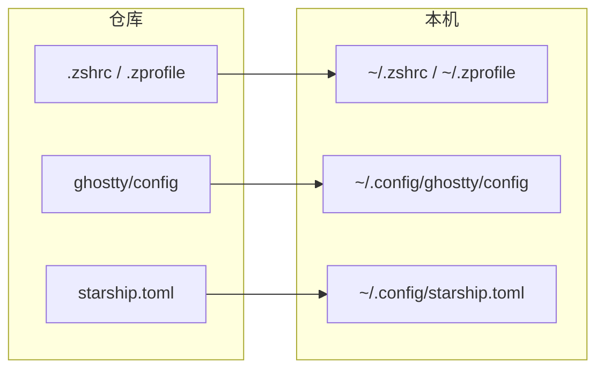

# config

个人 macOS 终端与工具配置仓库：用脚本把 `dotFiles` 同步到本机，也可一键初始化新环境。

## 快速开始

新机器推荐直接跑 bootstrap（安装依赖 + 同步配置）：

```bash
./bash/bootstrap.sh
```

常用参数：

| 参数 | 说明 |
|------|------|
| `--no-backup` / `-n` | 同步时不备份本地已有文件 |
| `--backup` / `-b` | 同步时备份（默认） |
| `--skip-brew` | 跳过 Homebrew 与依赖安装，只同步 |
| `--skip-sync` | 只装依赖，不同步配置 |

完成后打开新终端，或执行：

```bash
source ~/.zprofile && source ~/.zshrc
```

## 目录结构

```text
config/
├── bash/
│   ├── bootstrap.sh    # 一键：装依赖 + 同步全部配置
│   ├── syncall.sh      # 同步全部配置
│   ├── setzshrc.sh     # 同步 zsh 相关
│   └── setghostty.sh   # 同步 ghostty / starship
├── dotFiles/
│   ├── .zshrc
│   ├── .zprofile
│   └── ghostty/
│       ├── config
│       └── starship.toml
├── APP.md              # 常用 GUI 应用清单（不自动安装）
└── README.md
```

## 配置同步

### 一键同步全部

```bash
./bash/syncall.sh              # 默认备份后覆盖
./bash/syncall.sh --no-backup  # 不备份
```

### 分项同步

```bash
./bash/setzshrc.sh             # .zshrc + .zprofile
./bash/setghostty.sh           # ghostty config + starship.toml
```

所有同步脚本都支持 `--backup` / `-b`、`--no-backup` / `-n`。

### 文件映射

| 仓库路径 | 本机路径 |
|----------|----------|
| `dotFiles/.zshrc` | `~/.zshrc` |
| `dotFiles/.zprofile` | `~/.zprofile` |
| `dotFiles/ghostty/config` | `~/.config/ghostty/config` |
| `dotFiles/ghostty/starship.toml` | `~/.config/starship.toml` |

流程示意：



## 依赖说明

`bootstrap.sh` 会安装下列依赖（与 `.zshrc` / 终端配置对应）：

| 类型 | 包名 | 用途 |
|------|------|------|
| formula | `starship` | 命令行提示符 |
| formula | `fnm` / `pnpm` | Node 版本管理 / 包管理 |
| formula | `zoxide` | 智能目录跳转 |
| formula | `zsh-autosuggestions` | 命令建议 |
| formula | `zsh-syntax-highlighting` | 语法高亮 |
| cask | `ghostty` | 终端 |
| cask | `font-jetbrains-mono-nerd-font` | 终端字体 |

`.zprofile` 中配置了 Homebrew 清华镜像与 `brew shellenv`。

### 手动安装（可选）

若不用 bootstrap，可按需手动安装：

```bash
# Homebrew
/bin/bash -c "$(curl -fsSL https://raw.githubusercontent.com/Homebrew/install/HEAD/install.sh)"

# 终端与字体
brew install --cask ghostty
brew install --cask font-jetbrains-mono-nerd-font

# 提示符与工具
brew install starship fnm pnpm zoxide
brew install zsh-autosuggestions zsh-syntax-highlighting
```

装完后执行 `./bash/syncall.sh` 同步配置。

## 常用 GUI 应用

见 [APP.md](./APP.md)（清单备忘，不由脚本自动安装）。
